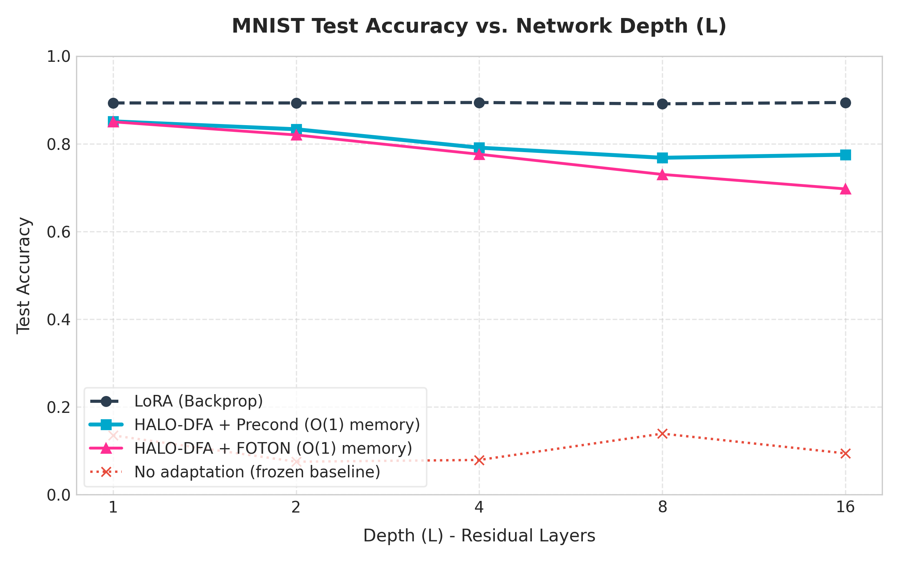
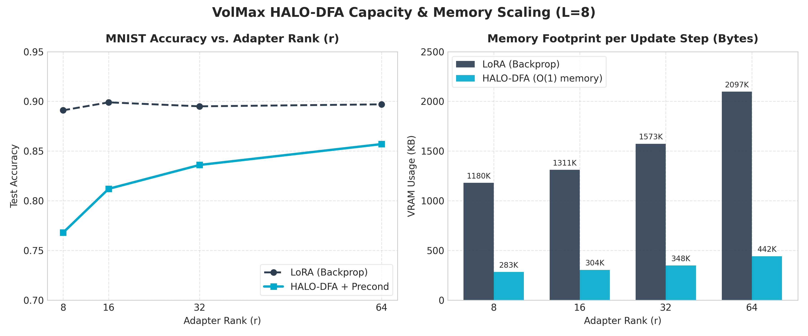

# Forward-Only Local Adaptation of a Frozen INT4 Base — O(1)-in-Depth Memory

A reproducible benchmark of **gradient-free, backprop-free local adaptation** of a frozen
INT4-quantized network, measured head-to-head against LoRA. The adaptation runs entirely
forward — no backward pass, no autograd graph — so its per-step memory is **constant in
network depth**, where LoRA's grows linearly.

This is an **honest proof-of-concept on feedforward nets (digits, MNIST)**, with a documented
hard boundary: the method does not extend to attention (tested below). It is not a large-model
result. See *Where it breaks* and *Scope & limitations* before reading anything else into it.

---

## What this is

A small adaptation layer ("HALO") sits on top of a frozen INT4 base and is updated by a
**three-part forward-only rule**, each part a known technique, combined and ablated here:

1. **DFA** (Direct Feedback Alignment, Nøkland 2016) — the global task error is projected
   onto each layer by a fixed random matrix, delivering a task signal to every layer
   without backpropagation.
2. **FOTON orthogonalization** (Fagnou et al. 2025, arXiv:2512.20668) — the adapter's input
   factor is kept orthogonal (via Newton–Schulz / Björck), which is what keeps the
   forward-only signal from collapsing as depth grows.
3. **Newton–Muon right preconditioning** — the update is whitened by the inverse
   second-moment of the bottleneck activations `(zᵀz + λI)⁻¹`, which closes part of the
   remaining accuracy gap to LoRA.

The contribution here is **the integration, the benchmark, and the ablations** — not the
individual techniques.

## Headline results (all regenerated from scratch by `reproduce.py`)

**Each component is necessary** — remove FOTON orthogonalization and the forward-only signal
collapses to chance in depth (digits):

| Depth L | plain DFA (no ortho) | with FOTON |
|--------:|---------------------:|-----------:|
| 4  | 0.185 (≈ chance) | 0.791 |
| 8  | 0.185 (≈ chance) | 0.741 |
| 16 | 0.189 (≈ chance) | 0.689 |

**It generalizes from digits (1.8k samples) to MNIST (60k)** — the ablation ordering holds:



| Depth L | no-adapt | LoRA | HALO+FOTON | +Precond |
|--------:|---------:|-----:|-----------:|---------:|
| 1  | 0.146 | 0.892 | 0.859 | 0.857 |
| 4  | 0.086 | 0.894 | 0.779 | 0.794 |
| 8  | 0.102 | 0.895 | 0.758 | 0.763 |
| 16 | 0.094 | 0.898 | 0.670 | 0.762 |

**The gap to LoRA is capacity-bound, not inherent** — it closes monotonically with adapter
rank, with diminishing returns, while the memory advantage *grows* (MNIST, L=8):



| rank r | LoRA | HALO | gap | memory advantage |
|-------:|-----:|-----:|----:|-----------------:|
| 8  | 0.895 | 0.763 | 0.132 | 4.17× |
| 16 | 0.900 | 0.817 | 0.083 | 4.31× |
| 32 | 0.896 | 0.853 | 0.043 | 4.52× |
| 64 | 0.897 | 0.860 | 0.037 | 4.74× |

The memory advantage is measured as peak adapt-step bytes (LoRA retains one activation tensor
per layer for the backward graph — O(L); HALO holds one layer's worth at a time — O(1)). At
L=8 this is ~4–5×; it scales with depth, so a deeper stack widens the gap further.

## Where it breaks: attention (tested, not assumed)

The method works on feedforward layers. It does **not** carry to attention. This was tested
directly, not assumed — and the negative result is documented here on purpose, because knowing
where a method stops mattering is part of the method.

Task: single-head-solvable associative recall (key→value retrieval), the canonical job of
attention. Adapt only the Q/K/V projections of a frozen INT4 attention block:

| method | test accuracy |
|---|---|
| LoRA on Q/K/V (backprop) | **0.997** |
| no adaptation | 0.177 |
| HALO-DFA (no ortho) | 0.126 |
| HALO+FOTON | 0.147 |
| HALO+FOTON+Precond | 0.153 |
| random baseline | 0.125 |

All forward-only variants collapse to chance. Localization (adapting only the *linear* output
projection W_o, Q/K/V frozen) reaches just 0.199 — confirming the failure is not a tuning issue.

**Why:** DFA cannot assign credit through the softmax. In an MLP the input→output map of each
layer is linear before the nonlinearity, so a random-projected error times the local activation
is a usable update. In attention, Q and K act on the output *through the attention distribution*
— deeply nonlinear, across the whole sequence. Associative recall needs a precise query-key
match, which is exactly the signal backprop carries through the softmax gradient and DFA's random
projection does not. This is consistent with the known weakness of feedback-alignment methods on
attention; it is an open research problem, not a bug in this code.

`attn_halo_gate.py` reproduces this table; `attn_sanity.py` shows the same testbed reaches 100%
under full backprop (so the testbed is healthy — the gap is the method, not the task).

## Scope & limitations (read this)

- **Feedforward layers only.** Results are on fully-connected nets over digits and MNIST, and
  the attention test above shows the method does **not** extend to transformer Q/K/V. This is
  **not** a transformer or LLM result. Forward-only attention credit assignment is an open
  research direction, not something this repo claims to solve.
- **MNIST at ~0.86–0.90 is MLP-ceiling, not SOTA** — CNNs reach 0.99. LoRA's ~0.89 here is the
  fair backprop ceiling *for this architecture*, the right comparison point, not an absolute.
- **LoRA still wins on accuracy** at equal rank. The pitch is memory, not accuracy: forward-only
  adaptation that holds O(1) memory in depth, at an accuracy cost that shrinks with rank.
- **λ for preconditioning is tuned per depth** (values in `reproduce.py`). They transfer from
  digits to MNIST without re-tuning, but they are not parameter-free.
- **Low-precision update caveat:** stochastic rounding of the *adapter itself* only helps on a
  fine grid (~INT8); on a coarse INT4 grid it injects more noise than signal. Adapters here are
  kept in higher precision; the *base* is INT4. (See commit history / `lowprec_sr.py`.)
- Trained on a 10k MNIST subset for runtime; full 60k would shift numbers marginally.

## Reproduce

```bash
pip install torch numpy scikit-learn matplotlib
python reproduce.py        # regenerates every number above in one run
```

`reproduce.py` downloads MNIST from a GitHub mirror and runs all three experiments
(FOTON necessity, MNIST depth ablation, rank capacity) from a single seed with no shared state.

## References

- Nøkland, *Direct Feedback Alignment Provides Learning in Deep Neural Networks*, NeurIPS 2016
- Fagnou et al., *Forward Only Learning for Orthogonal Neural Networks of Any Depth*, arXiv:2512.20668 (2025)
- Jordan, *Muon optimizer* (Newton–Schulz orthogonalization), 2024
- Gupta et al., *Deep Learning with Limited Numerical Precision* (stochastic rounding), ICML 2015
- Oja, *Simplified neuron model as a principal component analyzer*, 1982

Related work using Oja's rule for a *different* problem (KV-cache compression, not weight
adaptation): Zhu et al., *OjaKV*, arXiv:2509.21623 (2025) — cited for completeness, not part of
this method.
